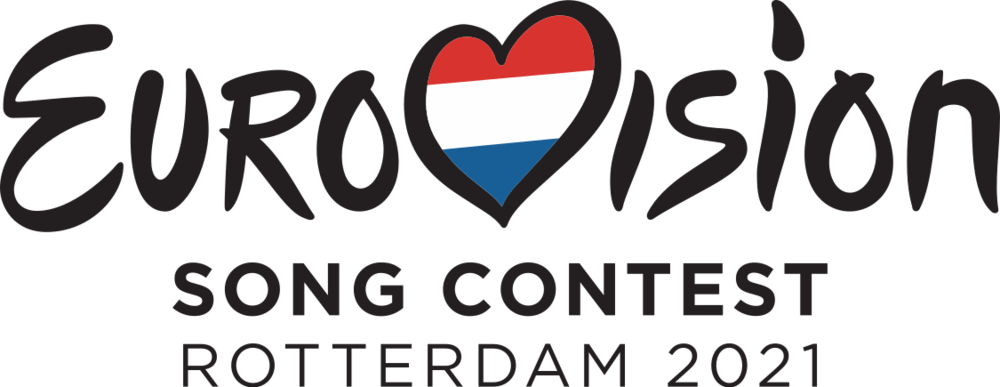

# Vote! Eurovision 2021 :eu: :netherlands:

[Read in english](https://github.com/missmay4/Eurovision-2021-Project/blob/master/README.md)

Hola! Este es un proyecto personal en el que apareceran todos los datos reltatios a la 65º edición de Eurovisión.

Debido a la crisis del CO-VID 19 que afecta a toda Europa, la edición del año 2020 fué cancelada y se postpuso a 2021, en la que algunos de los cantantes elegidos para el año anterior (y algunos nuevos) participarán con nuevas canciones.

Aquí se va a desarrollar una appliación web, dónde la mayor funcionalidad sera votar por tus favoritos, así cómo encontrar los datos relativos a los participantes de cada país y más...

## Tecnologías usadas: 
### Cliente: 
* [Vue JS](https://vuejs.org/)
### Servidor: 
* [Spring](https://spring.io/projects/spring-framework)
### Base de datos:
* [PostgreSQL](https://www.postgresql.org/)
### Interfaz web
* [Bootstrap](https://getbootstrap.com/)

## Gran Final _22/05/2021_

### Participantes

#### País Anfitrión:

- [x] Países Bajos :netherlands: (_Birth of a New Age - Jeangu Macrooy_)

#### Big Five:

- [x] Gran Bretaña :uk: (_Embers - James Newman_)
- [x] España :es: (_Voy a Quedarme - Blas Cantó_)
- [x] Francia :fr: (_Voilá - Barbara Pravi_)
- [x] Italia :it: (_Zitti e Buoni - Måneskin_ )
- [x] Alemania :de: (_I Don't Feel Hate - Jendrik_)

#### Participantes en la 1ª Semifinal: (_18/05/2021_)

- [ ] Macedonia del Norte :macedonia: (_Here I Stand - Vasil Garvanliev_)
- [ ] Bielorrusia :belarus: (_""_)
- [ ] Lituania :lithuania: (_Discoteque - The Roop_)
- [ ] Suecia :sweden: (_Voices - Tusse_)
- [ ] Eslovenia :slovenia: (_Amen - Ana Soklič_)
- [ ] Australia :australia: (_Technicolour - Montaigne_)
- [ ] Irlanda :ireland: (_Maps - Lesley Roy_)
- [ ] Rusia :ru: (_Russian Woman - Manizha_)
- [ ] Noruega :norway: (_Fallen Angel - Tix_)
- [ ] Chipre :cyprus: (_El Diablo - Elena Tsagrinou_)
- [ ] Croacia :croatia: (_Tick-tock - Albina_)
- [ ] Azerbaiyán :azerbaijan: (_Mata Hari - Efendi_)
- [ ] Malta :malta: (_Je Me Casse - Destiny_)
- [ ] Israel :israel: (_Set Me Free - Eden Alene_)
- [ ] Ucrania :ukraine: (_Shum - Go_A_)
- [ ] Rumania :romania: (_Amnesia - Roxen_)
- [ ] Bélgica :belgium: (_The Wrong Place - Hooverphonic_)

#### Participantes en la 2º Semifinal: (_20/05/2021_)

- [ ] Austria :austria: (_Amen - Vincent Bueno_)
- [ ] Moldavia :moldova: (_Sugar - Natalia Gordienco_)
- [ ] Polonia :poland: (_The Ride - RAFAŁ_)
- [ ] San Marino :san_marino: (_Adrenalina- Senhit_)
- [ ] Serbia :serbia: (_Loco Loco - Hurricane_)
- [ ] Islandia :iceland: (_10 Years - Daði & Gagnamagnið_)
- [ ] República Checa :czech_republic: (_Omaga - Benny Cristo_)
- [ ] Grecia :greece: (_Last Dance - Stefania Liberakakis_)
- [ ] Estonia :estonia: (_The Lucky One - Uku Suviste_)
- [ ] Dinamarca :denmark: (_Øve os på hinanden - Fyr og Flamme_)
- [ ] Bulgaria :bulgaria: (_Growing Up Is Getting Old - Victoria Georgieva_)
- [ ] Suiza :switzerland: (_Tout L'Univers - Gjon's Tears_)
- [ ] Finlandia :finland: (_Dark Side - Blind Channel_)
- [ ] Georgia :georgia: (_You - Tornike Kipiani_)
- [ ] Letonia :latvia: (_The Moon Is Rising - Samanta Tīna_)
- [ ] Portugal :portugal: (_Love is on my Side - The Black Mamba_)
- [ ] Albania :albania: (_Karma - Anxhela Peristeri_)

#### No clasificados:
