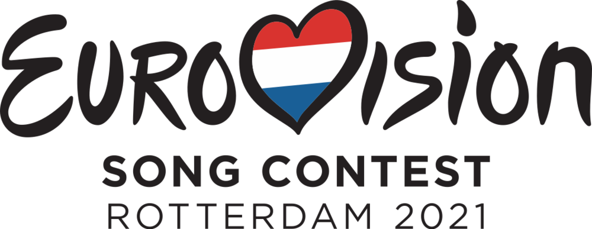

# Vote! Eurovision 2021 :eu: :netherlands:

[Leer en español](https://github.com/missmay4/Eurovision-2021-Project/blob/master/README-ES.md)

Hello! This is a personal project in which all the data relating to the 65th edition of Eurovision are shown.

Due to the CO-VID 19 crisis affecting the whole of Europe, the 2020 edition was canceled, so the contest has been postponed until this year, in which some of the last year singers (and some new) would participate with new songs.

Here I'll develop a web application, where most of the function will be **vote** for your favorites, as well as find the data relative to the participants of each country and more...

## Technologies: 
### Client: 
* [Vue JS](https://vuejs.org/)
### Server: 
* [Spring](https://spring.io/projects/spring-framework)
### Database:
* [PostgreSQL](https://www.postgresql.org/)
### Web Interface
* [Bootstrap](https://getbootstrap.com/)

## Grand Final _22/05/2021_

### Participants

#### Host Country:

- [x] Netherlands :netherlands: (_Birth of a New Age - Jeangu Macrooy_)

#### Big Five:

- [x] Great Britain :uk: (_Embers - James Newman_)
- [x] Spain :es: (_Voy a Quedarme - Blas Cantó_)
- [x] France :fr: (_Voilá - Barbara Pravi_)
- [x] Italy :it: (_Zitti e Buoni - Måneskin_ )
- [x] Germany :de: (_I Don't Feel Hate - Jendrik_)

#### 1st Semifinal Participants: (_18/05/2021_)

- [ ] North Macedonia :macedonia: (_Here I Stand - Vasil Garvanliev_)
- [ ] Belarus :belarus: (_""_)
- [ ] Lithuania :lithuania: (_Discoteque - The Roop_)
- [ ] Sweden :sweden: (_Voices - Tusse_)
- [ ] Slovenia :slovenia: (_Amen - Ana Soklič_)
- [ ] Australia :australia: (_Technicolour - Montaigne_)
- [ ] Ireland :ireland: (_Maps - Lesley Roy_)
- [ ] Russia :ru: (_Russian Woman - Manizha_)
- [ ] Norway :norway: (_Fallen Angel - Tix_)
- [ ] Cyprus :cyprus: (_El Diablo - Elena Tsagrinou_)
- [ ] Croatia :croatia: (_Tick-tock - Albina_)
- [ ] Azerbaijan :azerbaijan: (_Mata Hari - Efendi_)
- [ ] Malta :malta: (_Je Me Casse - Destiny_)
- [ ] Israel :israel: (_Set Me Free - Eden Alene_)
- [ ] Ukraine :ukraine: (_Shum - Go_A_)
- [ ] Romania :romania: (_Amnesia - Roxen_)
- [ ] Belgium :belgium: (_The Wrong Place - Hooverphonic_)

#### 2nd Semifinal Participants: (_20/05/2021_)

- [ ] Austria :austria: (_Amen - Vincent Bueno_)
- [ ] Moldova :moldova: (_Sugar - Natalia Gordienco_)
- [ ] Poland :poland: (_The Ride - RAFAŁ_)
- [ ] San Marino :san_marino: (_Adrenalina- Senhit_)
- [ ] Serbia :serbia: (_Loco Loco - Hurricane_)
- [ ] Iceland :iceland: (_10 Years - Daði & Gagnamagnið_)
- [ ] Czech Republic :czech_republic: (_Omaga - Benny Cristo_)
- [ ] Greece :greece: (_Last Dance - Stefania Liberakakis_)
- [ ] Estonia :estonia: (_The Lucky One - Uku Suviste_)
- [ ] Denmark :denmark: (_Øve os på hinanden - Fyr og Flamme_)
- [ ] Bulgaria :bulgaria: (_Growing Up Is Getting Old - Victoria Georgieva_)
- [ ] Switzerland :switzerland: (_Tout L'Univers - Gjon's Tears_)
- [ ] Finland :finland: (_Dark Side - Blind Channel_)
- [ ] Georgia :georgia: (_You - Tornike Kipiani_)
- [ ] Latvia :latvia: (_The Moon Is Rising - Samanta Tīna_)
- [ ] Portugal :portugal: (_Love is on my Side - The Black Mamba_)
- [ ] Albania :albania: (_Karma - Anxhela Peristeri_)

#### Not Qualified:
